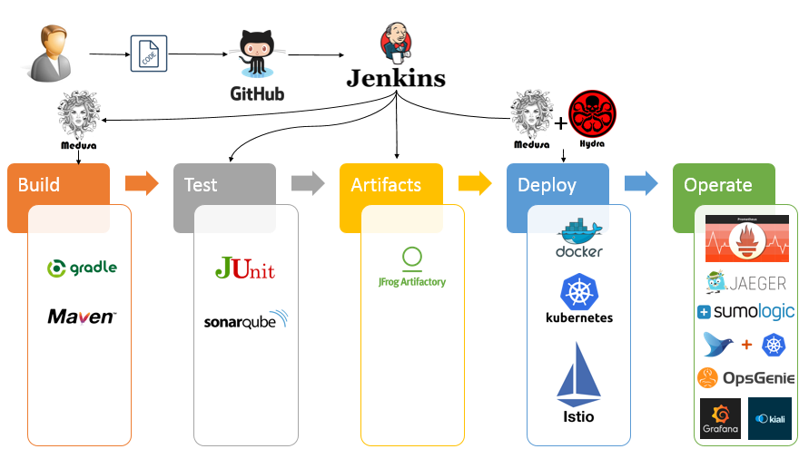
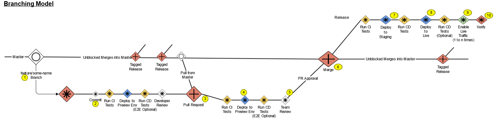

# SDLC for Reference Architecture 1.5

:exclamation:__Note:__ For the PI13.3 architecture drop, this document is specific to Java Spring Boot and Node.js edge microservces. It will remain so until the RefArch1.5 implementation is far enough along that the document becomes common to all RefArch1.5 supported technologies.:exclamation:

- [Overview](./Development_Operating_Procedures_JSB_or_Node_Microservices.md#Overview)
- [Introduction](./Development_Operating_Procedures_JSB_or_Node_Microservices.md#Introduction)
- [Logical SDLC Workflow](./Development_Operating_Procedures_JSB_or_Node_Microservices.md#LogicalSDLCWorkflow)
- [Dev-Centric Culture](./Development_Operating_Procedures_JSB_or_Node_Microservices.md#Dev-CentricCulture)
- [Definitions](./Development_Operating_Procedures_JSB_or_Node_Microservices.md#Definitions)
- [GitHub Flow Branching Strategy](./Development_Operating_Procedures_JSB_or_Node_Microservices.md#GitHubFlowBranchingStrategy)
- [Reference Branching Model](./Development_Operating_Procedures_JSB_or_Node_Microservices.md#ReferenceBranchingModel)
- [SDLC Assertions](./Development_Operating_Procedures_JSB_or_Node_Microservices.md#SDLCAssertions)
- [Pipeline Quality Gates](./Development_Operating_Procedures_JSB_or_Node_Microservices.md#PipelineQualityGates)
- [Reference Architecture 1.5 Pipelines](./Development_Operating_Procedures_JSB_or_Node_Microservices.md#ReferenceArchitecture1.5Pipelines)
- [Versioning](./Development_Operating_Procedures_JSB_or_Node_Microservices.md#Versioning)
- [Feature Toggles](./Development_Operating_Procedures_JSB_or_Node_Microservices.md#FeatureToggles)
- [References](./Development_Operating_Procedures_JSB_or_Node_Microservices.md#References)

# Overview

This page defines the Reference Architecture 1.5 SDLC to be used by teams in the delivery of business value differentiating functionality via the [Medusa]-based pipelines. This is a living document, which will be continuously updated as information becomes available based on team experiences and input from technology, business, and PPMO organizations.

# Introduction

This document defines the Software Development Life-cycle (SDLC) for the 1.5 Reference Architecture.  The SDLC is the workflow a developer uses to deliver business value into Live environments.  It defines the developer workflow, branching strategy, and best practices to be used when developing and releasing applications and services into our private and public cloud environments through the [Medusa] based pipelines.  The Reference Architecture 1.5 SDLC and branching strategy is informed by the AWS/Microservices Reference Architecture 1.0 and the On-Prem Reference Architecture.

**AWS/Microservice Reference Architecture SDLC:**

- [SDLC for Reference Architecture](http://confluence/display/entarch/SDLC+for+Reference+Architecture)
- [PLATFORM-207: Github Flow](http://confluence/display/entarch/PLATFORM-207%3A+Github+Flow)

**On-Prem Reference Architecture SDLC:**

- [SDLC for On-Prem Reference Architecture](http://confluence/display/ART/SDLC+for+On-Prem+Reference+Architecture)

# Logical SDLC Workflow 

A complex workflow blocks developer productivity.  The following workflow, enforced through the use of the [Medusa] pipeline library, creates a simple yet powerful workflow that enables:

- Faster delivery of business value into Live environments
- Enforcement of key NFRs, without any developer effort
- Complete consistency across all environments
- Dedicated Preview environment for acceptance testing prior to merge

# Dev-Centric Culture 

See: [http://confluence/display/entarch/Reference+Architecture#ReferenceArchitecture-DevCentricculture](http://confluence/display/entarch/Reference+Architecture#ReferenceArchitecture-DevCentricculture)

#### Extensive Collaboration and Shared Responsibility

- Partnership with Site Reliability Team, NOC, LiveOps in Monitoring Live
- Team owns ensuring Live viability for all changes promoted to Master

#### No Silos

- Co-Ownership with SRE, LiveOps of:  Live monitoring of errors rates/dashboards, alerts, performance telemetry dashboards
- Quality is a concern of development (built-in quality)

#### Autonomous Teams

- Team owns creation of Pull Requests into Master.
- Team owns PR approvals and acts as Continuous Operations owner. In certain cases SA/Program Team level approval may be needed.

#### High Quality Development Process

- Team ensures all quality-first practices are followed
- CI processes provide fast feedback to teams
- CD processes enforce testing gates
- Teams leverage Preview environment for acceptance
- Teams build resiliency into systems
  - circuit breakers
  - zero downtime deployments

#### Valuing Feedback

- Teams look to measure everything and drive continuous improvement from metrics
- Teams value and respond quickly to defects reported from SRE, LiveOps and CustSat

#### Automation

- Teams build pipelines to Live following the Reference Architecture 1.5
- See:  [https://github.com/EBSCOIS/platform.training.refarch1.5-devguide](https://github.com/EBSCOIS/platform.training.refarch1.5-devguide)

# Definitions

- **Master** - EBSCOIS base repository. This repository is the starting point for all branches. All builds and deployments are sourced from this repository. Only the builds should have access to master. Only user story branches should be created here. Tags should be long-lived snapshots of the code.
- **User Story Branch Origin** - Personal repository. Each developer has their own origin. Developers can grant access to their origin as desired. Master branch should never contain local changes/work. User Story Branch Origins should always be kept in sync with the Master.
- **User Story Branch Local** - Local repository on the developers machine.
- **Developer Remotes** - Additional remotes added to collaboratively work with developers without triggering a build

# GitHub Flow Branching Strategy 

* The Branching Strategy for microservices in the Reference Architecture 1.5 follows a variation of the simplified GitHub Flow model that uses a &quot;Branch and Merge&quot; process: [https://help.github.com/articles/github-flow/](https://help.github.com/articles/github-flow/)
  * __Note:__ the variation from the simplified GitHub Flow model is that we do not make use of `release/` branches. We release directly from the master branch.
    * The format of release branch names is very specific. It is described in the [Repository Branches section of the Medusa readme].
* Infrastructure projects do use `Release` branches in order to support the "drop" cadence model we are using for early platform development.
* __Note__ all branches must be named according to the rules described in the [Repository Branches section of the Medusa readme]

# Reference Branching Model 

| # | Step | Description |
| :---: | --- | --- |
| 1 | Create User Story Branch | Clone Master and create a tagged branch.  Dev work scaled to two-week development and release. |
| 2 | Commit Changes | Make changes to local, run tests locally, then push to Branch Origin.  CI process triggers test run. |
| 3 | CI Pipeline publishes versioned pre-release artifact | Artifact pushed to ECS. |
| 4 | Preview Environment created | Used for developer testing. |
| 5 | Create PR |   |
| 6 | CI Pipeline publishes versioned pre-release artifact | Artifact pushed to ECS. |
| 7 | Preview Environment created | Used for feature/story acceptance testing and team demos. |
| 8 | Master Merge | PR approval required. |
| 9 | CI Pipeline publishes versioned release artifact | Artifact pushed to ECS. |
| 10 | CD Pipeline Release into Integration Env | Follows Canary deployment pattern. Automated release verification performed. Automatic promotion if gate passes. |
| 12 | CD Pipeline Release into Live Env(s) | Follows Canary deployment pattern. Automated release verification performed. |
| 13 | Enable Live traffic | Automated promotion once all gates are passed. |
| 14 | Review and Verify | Operations confirmed with live traffic. Validate Performance and Behavior. |

# SDLC Assertions 

- All User Story Branches are created from Master
  - Do update (Pull down from Master) into your User Story branches frequently (At least daily)
  - Do merge to Master regularly (At least weekly)
- Master is kept in a releasable state at all times
  - The Master represents a collection of Live versions and intended releases
  - Do Not commit into Master directly
  - Do apply Hotfixes using a User Story Branch
  - Do Not rebase Master
- A push to a public branch triggers a CI build
  - A versioned pre-release artifact is created
  - Unit tests are run (as determined by archetype)
  - Integration tests are run (as determined by archetype)
- A push to a public branch triggers the creation of a Preview env
  - Quality gates must pass in this env
  - Preview environments live for only 2 hours
- A Pull Request triggers the creation of a Preview env
  - Quality gates must pass in this env
  - Static analysis is run (as determined by archetype)
  - Team level Acceptance testing is done in this env
  - Do push user story branches for discussion prior to issuing a PR
  - PRs should represent small code changes that can be reviewed quickly
  - Do Not introduce breaking changes (follow SOLID, 12-factor)
- A Pull Request Approval triggers the merge into Master
  - PO/PM/SA acceptance drives PR approval
- A merge into Master triggers the CD process
  - Do Not merge in broken code
  - Do Not merge with conflicts (handle conflicts upon rebasing)
  - All releases are tagged automatically by pipeline

# Pipeline Quality Gates 

Each delivery into an environment (Preview, Int, Live) follows the Canary promotion methodology supported by [Hydra].  All promotion events must be gated by the successful completion of a Quality Gate consisting of a set of tests appropriate for the environment.  This helps to ensure that the version of the service being promoted into use within a given environment is fit-for-purpose.

## Test Gates

For guidance on testing, including Consumer-Driven Contract testing and Performance testing, see:  [Microservices Test Strategy](http://confluence/display/~abhavan/Microservices+Test+Strategy)

### Sonarqube Static Code Analysis

Gate consists of static code anlysis using Sonarqube.  Outcome of this stage is a report that teams will use to assess code quality to help drive identification of tech debt stories for backlog.  Standard Sonarqube Quality Profiles have been established for a number of different programming languages.  See this Yammer post:  [Yammer](https://www.yammer.com/ebsco.com/#/Threads/show?threadId=1160757472&amp;search_origin=global&amp;scoring=linear1Y-prankie-group-private-higher&amp;match=any-exact&amp;search_sort=relevance&amp;page=1&amp;search=chris%20matheson)

### Unit Test Gate

All unit tests associated with the project are run.  Any test failure blocks pipeline progress.

### Integration Test Gate

All integration and/or contract tests associated with the project are run.  Any test failure blocks pipeline progress.

### End-to-End Test Gate

All long running end-to-end tests associated with the project are run.  Any test failure blocks pipeline progress.

### Performance Test Gate

Performance tests are run by mirroring Live traffic.  Gate compares metrics from new build against established baselines.  Gate fails if performance is not within a specified margin.  Failure blocks Canary promotion in INT and Live environments.

## Stage Gates

### PR/feature Branch Builds

CI process initiated by a commit into a PR or feature branch. The following gates are triggered and a preview environment is created:

- Unit tests.
- Contract tests.
- Integration tests.
- Sonarqube Static Code Analysis.
- End-to-End tests (against service Preview)

### Master Branch Builds

CI process initiated by a PR merge to Master.  The following gates are triggered:

- Unit tests.
- Contract tests.
- Integration tests.
- Sonarqube Static Code Analysis.
- End-to-End tests.
- Performance tests.

### Preview

Initiated by the creation of a PR.

Acceptance testing at the team level is done in this environment.  PRs should not be approved until sufficient testing has been completed for the PO/PM/SA to accept the feature or user story.

### INT

The INT environment is the first "real" Assembly Line environment pipelines deliver into. End-to-end integration and performance tests are executed.

### Live

The Live environments are the final environments that the pipelines deliver into.  The Live environments are where we need to ensure the newly deployed version is operationally viable.  End-to-end integration and performance tests are executed.

# Reference Architecture 1.5 Pipelines 

### Notes:

- Developers should run tests locally before committing changes to a remote branch.
- A check-in to a remote branch triggers a CI build.  Unit & Integration tests are run (as determined by the archetype).
- A PR into Master triggers the generation of a versioned pre-release artifact (that represents a merging the branch and master), and deployment of that artifact in a Preview environment.
- Team/ART level Acceptance testing is performed in the PR Preview environment.
- PR approval and merge triggers a build of the master branch resulting in deployment into INT and Live.
- Canary deployment used in all environments:
  - All automated gates must pass before full promotion

# Versioning

[Semantic Versioning](http://semver.org/) is used by all services being delivered into an environment.

Given a version number MAJOR.MINOR.PATCH, versioning is handled in the following manner:

1. MAJOR version must be incremented when you make incompatible API changes. 
    - Developers have control of this part of the version. It can be set in the [applicationDefinition.yaml](https://github.com/EBSCOIS/platform.infrastructure.medusa/blob/master/README.md#application-definition-file) file.
    - Strictly speaking however, there should be no need to change this part of the version when developing a microservice, because any breaking change should be deployed as a new service out of a new project repo, e.g. breaking changes in a service named `myService` should be made in a new project repo resulting in `myService2`.
2. MINOR version increments automatically as part of the build process. Developers have no control over this part of the version number. For the purposes of pipeline automation no distinction is made between "new features" and "bug fixes" with respect to the MINOR version number.
3. PATCH version does not change. It serves no specific purpose other to remain compatible with systems and services that require a 3 part version.

# Feature Toggles 

### Note:  Support for Feature Toggles in 1.5 will not be in place until after PI13.

[Feature Toggles](https://martinfowler.com/articles/feature-toggles.html) **may be used to:**

- isolate work in progress
- provide a mechanism to dynamically enable new business functionality post release
- enable canary testing of experimental algorithms
- enable A/B testing

**Feature Toggle Best Practices:**

- Feature Toggles must have a defined expiration date.
- Treat Feature Toggles as Technical Debt.  Code supporting the feature toggle must be removed once the defined expiration date has been met.
- Testing must cover all Feature Toggle permutations - USE THEM SPARINGLY.

# References

### Reference Architecture Test Standards

- [Microservices Test Strategy](http://confluence/display/~abhavan/Microservices+Test+Strategy)
- [SERVICES-260: Pipeline Testing](http://confluence/display/entarch/SERVICES-260%3A+Pipeline+Testing)
- [UI-260: DevTest - Automated E2E testing](http://confluence/display/entarch/UI-260%3A+DevTest+-+Automated+E2E+testing)
- [SERVICES-270: Microservices Testing](http://confluence/display/entarch/SERVICES-270%3A++Microservices+Testing)
- [SERVICES-280: Testing Overview](http://confluence/display/entarch/SERVICES-280%3A+Testing+Overview)

### Sonarqube Quality Profiles:

[http://sonarqube73.eis-platformlive.cloud/profiles](http://sonarqube73.eis-platformlive.cloud/profiles)

### Reference Architecture 1.5 Feedback Channel

[Link to Teams Channel](https://teams.microsoft.com/l/team/19%3afa2ca3ef3b8042438565ebe7c5e71731%40thread.skype/conversations?groupId=9b1ce806-0126-471c-8e35-77b3115110e6&amp;tenantId=50fa36ca-7dd3-44f1-9e3f-1bf39a3963a5)

<!--- Reused Links --->
[Medusa]: https://github.com/EBSCOIS/platform.infrastructure.medusa
[Hydra]: https://github.com/EBSCOIS/platform.infrastructure.hydra
[Repository Branches section of the Medusa readme]: https://github.com/EBSCOIS/platform.infrastructure.medusa/README.md#repository-branches
